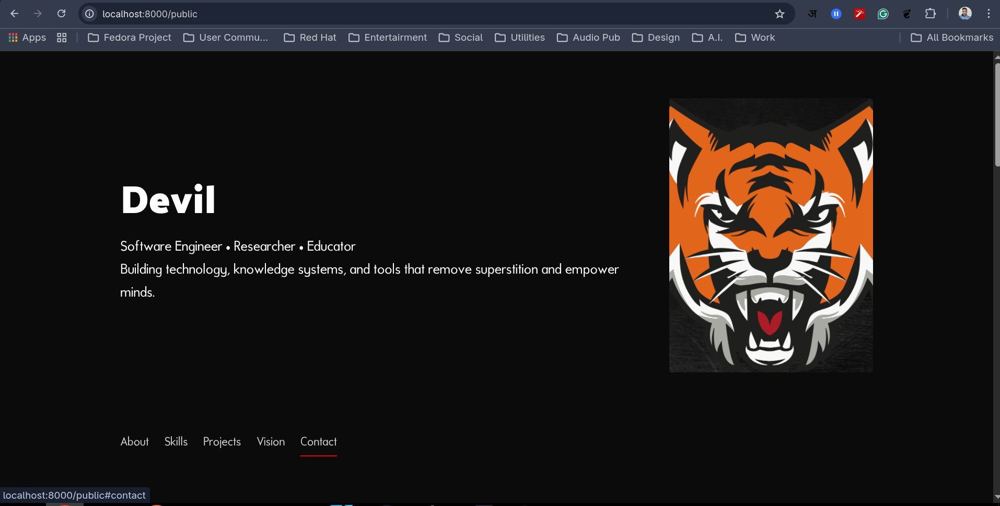

# Portfolio CMS 

# V2.0

- shift technology from php to golang
- changed UI
- fix database

# About 
A simple portfolio template with CMS:
- public homepage rendering from JSON schema stored in MySQL
- an admin visual editor for the home page
- image uploads stored in `uploads/`


<table>
  <tr>
    <td width="58%" valign="top">
      
    </td>
    <td width="42%" valign="top">
      
    </td>
  </tr>
</table>

## Project structure

- `main.go` — Go HTTP server, routing, auth, uploads, and database logic
- `templates/` — Go templates for the public page and admin screens
- `public/` — static frontend assets
  - `public/js/renderer.js` — client-side renderer
  - `public/js/schema_contracts.js` — section validation rules
  - `public/css/style.css` — frontend and admin styling
- `uploads/` — uploaded image assets
- `sql/schema.sql` — schema for initial database tables
- `.env` — database credentials and app settings

## Requirements

- Go 1.25+
- MySQL / MariaDB

## Setup

1. Create the database and tables

   Import `sql/portfolio.sql` into your MySQL database:

   ```bash
   mysql -u <user> -p < sql/portfolio.sql
   ```

2. Configure environment values

   Copy `.env` from `env_exmaple.txt` if needed, then update values:

   ```text
   DB_HOST=127.0.0.1
   DB_PORT=3306
   DB_NAME=portfolio
   DB_USER=your-user
   DB_PASS=your-pass
   DB_CHARSET=utf8mb4
   APP_ADDR=:8080
   APP_SECRET=change-me
   ```

3. Ensure `APP_SECRET` is stable in non-dev environments.

4. If you need an admin user, insert one manually into `admin_users`.

   Example SQL:

   ```sql
   INSERT INTO admin_users (username, password)
   VALUES ('admin', '<bcrypt_hash>');
   ```

## Run locally

From the project root:

```bash
go run .
```

Then open:

- `http://127.0.0.1:8080/` — public homepage
- `http://127.0.0.1:8080/admin/login` — admin login
- `http://127.0.0.1:8080/admin/editor` — visual editor after login

> Important: start the server from the repository root so `public/`, `templates/`, and `uploads/` are available.

> The credentials of admin user which is predefined for login is: username=>ankit, password=>admin123

## Notes

- The homepage loads JSON schema from `/api/pages?slug=home`.
- Uploaded images are saved under `uploads/` and served from `/uploads/...`.
- The admin UI edits only the `home` page schema.

## Troubleshooting

- `port already in use`: choose another port:

  ```bash
  APP_ADDR=:8081 go run .
  ```

- `404 Not Found` on `/`: confirm the Go server is running and open `http://127.0.0.1:8080/`.
- Images missing: make sure the file exists under `uploads/`.
- Admin login fails: make sure an `admin_users` record exists and the password hash is a valid bcrypt hash.

## Maintenance

- Edit page content from `/admin/editor` after login.
- The editor saves schema updates to `pages.schema`.
- Use `uploads/` for image files referenced by the page schema.
